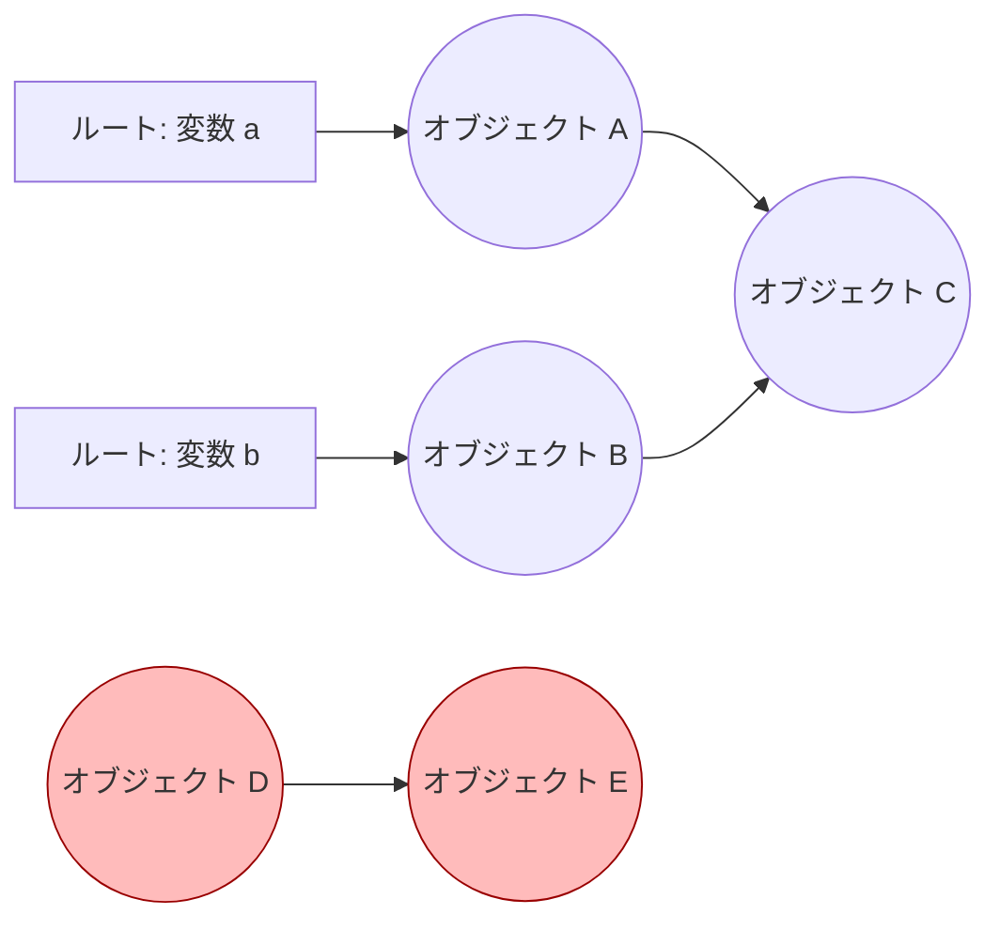
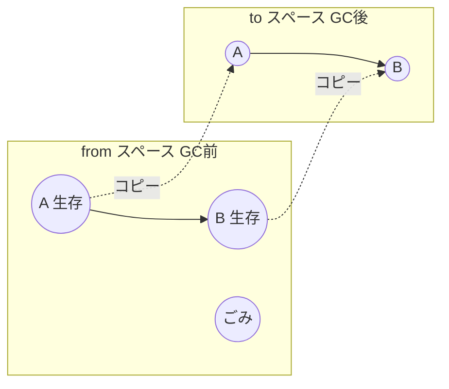

# GCの基本アルゴリズム

保守的GCを理解するには、まず「ふつうのGC」がどう動くのかを知る必要が
あります。実は、保守的GCの大半のメカニズムは通常のGCと同じで、違うのは
「どこにポインタがあるかをどう知るか」という一点だけだからです。この章
では、すべてのGCの基礎となる **到達可能性** の考え方と、代表的な3つの
アルゴリズム（参照カウント、mark-sweep、コピーGC）を学びます。

## 到達可能性：何を生かし、何を回収するか

前章で述べたとおり、GC の判断基準は「プログラムがまだアクセスできるか」
です。これを形式的に考えてみましょう。

ヒープ上のオブジェクトは、互いにポインタで参照し合い、巨大な
**有向グラフ (directed graph)** を成しています。ノードがオブジェクト、
辺がポインタです。このグラフには出発点があります。プログラムが「いま
まさに手に持っている」参照、すなわち

- グローバル変数
- 実行中の関数のローカル変数（スタック上にある）
- CPU のレジスタに入っている値

などです。これらをまとめて **[ルート](#index:ルート) (root / root set)**
と呼びます。

オブジェクトが **到達可能 (reachable)** であるとは、いずれかのルートから
ポインタをたどって（何ステップでもよい）そのオブジェクトに行き着ける、
ということです。到達可能なオブジェクトは将来使われるかもしれないので生か
し、到達できないオブジェクト（=ごみ、garbage）は回収します。



上の図では、A・B・C はルートから到達できるので生きています。D と E は
互いに参照し合っていますが、どのルートからもたどり着けないので「ごみ」
です。**互いに参照し合っていても、外から到達できなければ回収できる**——
この点が後で述べる参照カウントとの大きな違いになります。

> [!IMPORTANT]
> 「到達可能 = 生きている」は、あくまで安全側の近似です。プログラムが
> ある変数を二度と使わないとしても、変数が生きている限り GC はそれを
> 到達可能とみなして保守的に生かします。「論理的にもう使わない」ことを
> GC は知りようがないからです。この近似は、後で見る保守的GCの「偽ポインタ」
> 問題と同じ精神を持っています。

## アルゴリズム1：参照カウント

最も素朴なアプローチが **[参照カウント](#index:参照カウント)
(reference counting)** です。各オブジェクトに「自分を指しているポインタ
の数」を数えるカウンタを持たせます。

- ポインタが新しくオブジェクトを指したら、カウンタを +1
- ポインタがオブジェクトを指すのをやめたら、カウンタを −1
- カウンタが 0 になった瞬間、そのオブジェクトは誰からも参照されていない
  ので即座に解放する

```ruby
# 参照カウントの考え方（擬似コード）
def assign(slot, new_obj)
  new_obj.refcount += 1 if new_obj      # 新しい参照が増える
  old = slot.value
  slot.value = new_obj
  if old
    old.refcount -= 1                   # 古い参照が減る
    free(old) if old.refcount == 0      # 0 になったら回収
  end
end
```

参照カウントの長所は、回収が即時で、処理が局所的なことです。一方で、
2つの弱点があります。第一に、ポインタを書き換えるたびにカウンタ更新の
コストがかかります。第二に、**循環参照を回収できません**。先ほどの図の
D と E のように互いを指し合うと、カウンタは 1 のまま 0 になりません。
このため純粋な参照カウントだけでは循環するデータ構造を扱えず、別の仕組み
（後述のトレース型GC）と組み合わせるのが普通です [](#cite:jones2023)。

> [!NOTE]
> Python の CPython 実装は参照カウントを主軸にしつつ、循環参照を回収する
> ための補助的なトレース型GCを併用しています。「参照カウント vs トレース」
> は二者択一ではなく、組み合わせて使われることも多いのです。

## アルゴリズム2：mark-sweep

参照カウントが「各オブジェクトが局所的に判断する」方式だったのに対し、
**[mark-sweep](#index:mark-sweep)（マークアンドスイープ）** は、
グラフ全体を一気にたどって到達可能性を判定する **トレース型GC
(tracing GC)** の代表格です。本書の主役である保守的GCも、基本はこの
mark-sweep です。

mark-sweep は2つの段階（フェーズ）から成ります。

**マークフェーズ (mark phase):** ルートから出発してポインタをたどり、
到達できたオブジェクトすべてに「印（マークビット）」を付けます。これは
グラフの探索（深さ優先探索や幅優先探索）そのものです。

**スイープフェーズ (sweep phase):** ヒープ全体を端から端まで走査し、
マークが付いていないオブジェクトを解放します。同時に、次回のために
すべてのマークを消します。

```ruby
# mark-sweep の骨格（擬似コード）
def mark(obj)
  return if obj.nil? || obj.marked?    # 印済みなら再訪しない（循環対策）
  obj.mark!
  obj.each_pointer { |child| mark(child) }   # 参照先を再帰的にたどる
end

def collect(roots, heap)
  roots.each { |r| mark(r) }           # マークフェーズ
  heap.each do |obj|                   # スイープフェーズ
    if obj.marked?
      obj.unmark!                      # 次回に備えて消す
    else
      free(obj)                        # ごみを回収
    end
  end
end
```

mark-sweep は循環参照を問題なく回収できます（到達できなければ、たとえ
循環していてもマークされないからです）。一方、欠点は GC のたびにヒープ
全体を走査する必要があり、その間プログラムを止める **[ストップ・ザ・ワールド](#index:ストップ・ザ・ワールド)
(stop-the-world)** な停止が発生しやすいことです。この停止を短くする工夫
として、Dijkstra らはプログラムと並行して動く on-the-fly GC を提案しま
した [](#cite:dijkstra1978)。

mark-sweep のもう一つの特徴は、**オブジェクトを動かさない（non-moving）**
ことです。回収しても生きているオブジェクトはその場に残ります。この性質は、
後で見るように保守的GCにとって決定的に重要になります。

## アルゴリズム3：コピーGC

3つめは **[コピーGC](#index:コピーGC) (copying GC)** です。ヒープを
2つの等しい領域（fromスペースとtoスペース）に分け、片方だけを使います。

GC が走ると、fromスペースの中の到達可能なオブジェクトを、すべて
toスペースへ**コピー**します。コピーが終わったら from と to の役割を
入れ替えます。ごみは「コピーしない」だけで自動的に置き去りにされるので、
スイープのようにヒープ全体を走査する必要がありません。生きているオブ
ジェクトだけを訪問すればよいのです。C. J. Cheney は、これを補助スタック
なしに（toスペース自体を作業領域として使い）実現する巧妙な手法を示しま
した [](#cite:cheney1970)。



コピーGCの長所は2つあります。第一に、コピー後の toスペースには生きた
オブジェクトが隙間なく詰めて配置されるので、**断片化 (fragmentation)**
が起きません。第二に、空いた領域が連続するので、確保がポインタを進める
だけの非常に高速な操作になります。

しかし、ここに保守的GCとの根本的な緊張関係があります。コピーGCは
**オブジェクトを動かす（moving）** ため、そのオブジェクトを指していた
すべてのポインタを、新しいアドレスに**書き換え**なければなりません。
そのためには「どの値がそのオブジェクトを指すポインタなのか」を**正確に**
知る必要があります。次章で見るように、保守的GCはまさにこの「正確に知る」
ことを諦めた仕組みなので、素朴なコピーGCとは相性が悪いのです。

> [!CAUTION]
> 「ポインタを書き換える」ためには、それが本当にポインタだと確信できな
> ければなりません。もし整数 `12345` をたまたまポインタと誤認して書き
> 換えてしまったら、プログラムのデータを破壊してしまいます。この「動かす
> なら正確さが要る」という制約が、保守的GCの設計を大きく方向づけます。
> 詳しくは [](theory-of-conservative.md) で扱います。

## 3つのアルゴリズムの比較

ここまでの3つを整理しておきましょう。

| 方式 | 循環参照 | オブジェクトを動かす | 断片化 | 主なコスト |
|------|:--------:|:--------------------:|:------:|------------|
| 参照カウント | 回収できない | 動かさない | 起きる | ポインタ更新ごとの加算減算 |
| mark-sweep | 回収できる | 動かさない | 起きる | ヒープ全体の走査 |
| コピーGC | 回収できる | **動かす** | 起きない | 生存オブジェクトのコピー |

保守的GCは、この中の **mark-sweep** を土台にします。なぜなら mark-sweep
は **オブジェクトを動かさない** ため、「これはポインタかもしれない」と
いう曖昧な判断だけで安全に動かせるからです。この理由を次章でしっかり
解き明かしていきます。
