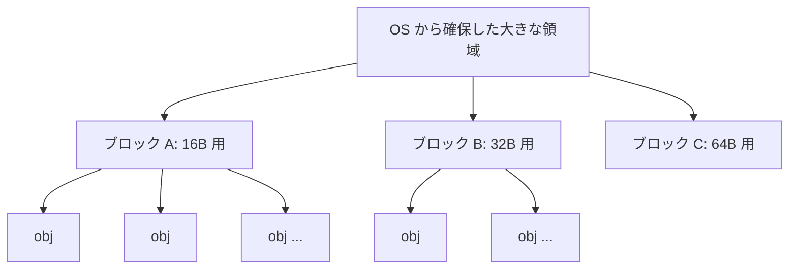
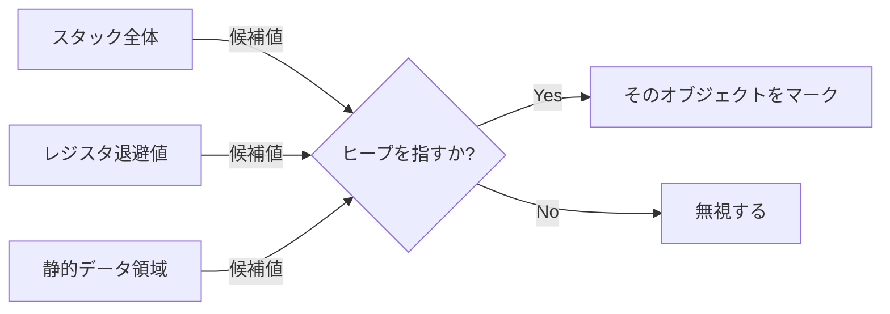

# libgc の裏側

前章では libgc を「使う」側に立ちました。この章では、その内部に分け入り
ます。`GC_MALLOC` を呼ぶと何が起きるのか。GC はどうやってスタックや
レジスタからルートを集めるのか。「この値はヒープを指しているか」をどう
判定しているのか。そして、保守的GCならではの偽ポインタ問題に、libgc は
どんな工夫で立ち向かっているのか。これらを順に見ていきます。

## ヒープの構造：サイズごとのブロック

libgc はヒープを、OS から大きな塊（チャンク）でまとめて受け取り、それを
**ブロック (block)** と呼ばれる固定サイズ（典型的には4KB、メモリページ
1枚ぶん）の単位に切り分けて管理します。

ここが要点ですが、**1つのブロックは1種類のサイズのオブジェクトだけを
入れる** よう使われます。たとえばあるブロックは16バイトのオブジェクト
専用、別のブロックは32バイト専用、という具合です。同じ大きさのオブジェクト
をまとめる方式を **サイズクラス (size class)** による管理と呼びます。



この設計には、保守的GCにとって嬉しい効果があります。あるアドレスが
与えられたとき、「それがどのブロックに属するか」はアドレスを
ブロックサイズで割るだけで求まり、ブロックがわかれば「そこに入っている
オブジェクトのサイズ」も即座にわかります。つまり **任意のアドレスから、
それがどのオブジェクトの内部を指しているかを高速に逆引きできる** のです。
保守的GCはメモリ上の無数の値について「これはヒープを指すか？」を問い続け
るので、この逆引きが速いことは死活的に重要です。

各ブロックはヘッダを持ち、その中に **マークビットの配列** を保持します。
オブジェクトごとに1ビットを割り当て、マークフェーズで立てます。マーク
ビットをオブジェクト本体とは別の場所（ブロックヘッダ）にまとめておくのは、
オブジェクトの中身に手を触れずに済ませる工夫でもあります。

## ルートの収集：スタック・レジスタ・静的領域

GC が始まると、まずルートを集めます。正確なGCならスタックマップを見る
ところですが、保守的GCにはそれがありません。代わりに libgc は、ルートに
なりうる領域を **丸ごとスキャン対象** にします。

- **スタック**：現在のスタックポインタから、スタックの底までの全範囲。
  この中の語をすべてポインタ候補として調べます。スタックの底（開始位置）
  は、`GC_INIT()` の時点やOSの情報から推定します。
- **レジスタ**：CPU のレジスタにポインタが入ったままGCが起きるかもしれ
  ません。libgc はレジスタの内容をいったんスタックに退避させてから（
  `setjmp` などを使って）、まとめてスキャンします。
- **静的データ領域**：グローバル変数や静的変数が置かれる領域（BSS や
  data セグメント）。ここに入っているポインタもルートです。



ここで重要なのは、libgc が **これらの領域の意味を一切解釈しない** こと
です。スタック上の値がローカル変数なのか、保存されたレジスタなのか、
関数の戻りアドレスなのかを区別しません。ただ全部の語について「ヒープを
指すように見えるか」だけを総当たりで調べます。これこそが、前章「GCの基本アルゴリズム」で述べた「あいまいなルート」の正体です。意味を問わないからこそ、コンパイラ
の協力なしに動けるのです。

## ポインタ妥当性の判定と内部ポインタ

「この値はヒープを指すか？」という問いを、libgc は2段階で答えます。

1. まず、値が libgc の管理するヒープのアドレス範囲に収まっているかを
   ざっと確認する。
2. 次に、先ほどのブロック構造を使って、その値が実際に確保済みオブジェクト
   の内部を指しているかを確かめる。割り当て済みでない（空き）位置を指して
   いれば、ポインタではないと判断する。

ここで保守的GCならではの配慮が必要になります。それが **[内部ポインタ](#index:内部ポインタ)
(interior pointer)** です。C のプログラムでは、オブジェクトの先頭では
なく途中を指すポインタがごく普通に現れます。

```c
char *buf = (char *)GC_MALLOC(100);
char *p = buf + 50;     /* オブジェクトの途中を指すポインタ */
/* このあと buf を捨てて p だけ残しても、buf 全体が生きていてほしい */
```

もし GC が「オブジェクトの先頭アドレスと一致する値だけをポインタとみなす」
設計だと、`p` のような内部ポインタを見落とし、`buf` を誤って回収して
しまいます。そこで libgc は、**オブジェクトの内部のどこを指していても、
そのオブジェクト全体を生かす** よう設計されています。先ほどの「アドレス
からブロックを逆引きし、オブジェクトのサイズがわかる」構造が、ここでも
効いています。途中のアドレスから所属オブジェクトの先頭を割り出せるから
です。

> [!NOTE]
> 内部ポインタを常に認識すると、後述する偽ポインタの確率がわずかに上がり
> ます。そのため libgc には内部ポインタの扱いを調整するオプション
> （`GC_all_interior_pointers`）があります。既定では安全側、つまり内部
> ポインタを認識する設定になっています。

## マークと遅延スイープ

ルートが集まったら、[mark-sweep](#index:mark-sweep) を実行します。基本
アルゴリズムは「GCの基本アルゴリズム」の章で見たとおりです。ルート
から到達できたオブジェクトのマークビットを立て（マークフェーズ）、立って
いないものを回収します（スイープフェーズ）。

ただし libgc のスイープには工夫があります。**遅延スイープ (lazy sweep)**
です。マークが終わった直後にヒープ全体を一気に走査するのではなく、その後
`GC_MALLOC` が呼ばれて「空きが必要になったとき」に、必要なぶんだけブロック
を走査して空きを回収します。回収の手間を実際の確保要求に合わせて分散させ
ることで、一度に長く止まることを避けています。

`GC_MALLOC` の中で空きが見つからなければ、libgc はまず遅延スイープで
回収を試み、それでも足りなければGC（マーク）を起動し、それでも足りなけ
れば OS からヒープを拡張します。確保関数の裏では、このような段階的な処理
が走っているのです。

## blacklisting：偽ポインタへの備え

ここからが保守的GCの核心的な工夫です。前章で述べたとおり、偽ポインタ
（たまたまヒープアドレスと一致した整数）は、本来回収すべきオブジェクトを
生かし続けてしまいます。libgc はこれに **[ブラックリスティング](#index:ブラックリスティング)
(blacklisting)** という手法で対抗します [Boehm](#cite:boehm1993)。

アイデアはこうです。GC は走査の途中で、「ヒープを指しているように見える
が、実際には確保済みオブジェクトを指していない値」に出会うことがあります。
これは「あと少しずれていたら偽ポインタになっていた、危険なビットパターン」
です。libgc はそうした値が指す **付近のアドレス（ブロック）を記録** して
おきます。これがブラックリストです。

そして、その後に新しくメモリを確保するとき、libgc は **ブラックリストに
載っているアドレスを避けて** オブジェクトを配置します。こうすると、その
危険なビットパターンが将来また現れても、そこには確保済みオブジェクトが
存在しないため、偽ポインタとして悪さをしません。「偽ポインタになりそうな
場所には、そもそも大事なものを置かない」という予防策です。

> [!TIP]
> ブラックリスティングは特に **大きなオブジェクト** で効果的です。大きな
> オブジェクトはアドレス範囲が広いぶん、偽ポインタに当たられる確率も高く、
> しかも巻き添えで保持されるメモリも大きいからです。libgc はこうした実装上
> の工夫を積み重ねることで、保守性に伴う空間オーバーヘッドを実用的な水準
> まで抑えています。空間使用量の理論的な裏付けは [](theory-of-conservative.md)
> で扱います。

## 並行・インクリメンタルGC：止まる時間を短くする

mark-sweep の弱点は、GC 中にプログラムを止める stop-the-world でした。
libgc はこれを和らげる **インクリメンタル／おおむね並行（mostly-parallel）**
なモードも備えています。これは Boehm、Demers、Shenker による手法に基づい
ています [Boehm et al.](#cite:boehm1991)。

鍵となるのは、**仮想メモリのページ保護機能** の活用です。OS は「あるメモリ
ページが書き換えられたか（dirty かどうか）」を検出する仕組みを持っています。
libgc はこれを使い、マーク作業をプログラム実行と少しずつ交互に進めます。
マークの途中でプログラムがオブジェクトを書き換えても、そのページが dirty
として記録されるので、GC はそのページだけを後でマークし直せばよいのです。
これにより、ヒープ全体を一度に走査するための長い停止を避けられます。
このモードは `GC_enable_incremental()` で有効化できます。

仮想メモリのハードウェア機能を使ってGCの停止を短くする——これは「OS や
ハードウェアの協力は得るが、コンパイラの協力は要らない」という、保守的GC
ならではのバランス感覚をよく表しています。

ここまでで、libgc が内部でどうポインタを探し、メモリを管理し、偽ポインタ
に備えているかが見えてきました。次章では、これらの工夫が「なぜ正しく動く
のか」「偽ポインタによるメモリ増加は理論上どこまで保証できるのか」という、
一段深い理論に踏み込みます。
